# **Tree standard**
## **Introduction**
This document describes standard for tree storage.

---

## **File format**
Tree should be stored in full-bracketed notation.

    ( {left descendant}? {node} {right descendant}? )

If node has no (left, right or both) descendant, the descendant is skipped. ex.:

    ((3)+(sin(5)))

`+` has descendants `3` and `sin`, `3` has no descendants, `sin` has only right descendant `5`.

---
## **Node format**
Nodes are divided into 3 groups: keywords, identificators, numbers.
### **Numbers**
Value should be written in `double`, node with number has no descendants.
### **Identifiers**
Identifiers are function, variable and array names.

Identifiers have to be surrounded with single quotes (ex. `'foo'`).
Round parenthesis mustn't be used.

* Function name has no descendants.
* Variable name may have left descendant `const` and right descendant, specifying index.
> If index is specified in assignment and variable wasn't declared before, index is used as array size. Otherwise index is used as shift in memory. See *'assignment'* for more information.

### **Keywords**
**Operators**

* `+`, `-`, `*`, `/`, `^`
* `<`, `>`, `<=`, `>=`, `==`, `!=`, `||`, `&&`, `!`

**Embedded standard functions**
* `sin`, `cos`, `ln`
* `print`, `scan`

**Support keywords**
* `if`, `decision`
* `while`
* `return`
* `define`, `call`, `function`, `parameter`
* `statement`
* `const`
* `main`

---

## **Tree format**

### ***Order of `parameter`, `statement`, `initializer`***
Sequence of `parameter`'s, `statement`'s, `initializer`'s starts from the bottom of branch.

    foo_with_param(first_param, second_param, third_param)
    {
        
    }
    bar_with_statements()
    {
        variable1 = 1;
        variable2 = 2;
        variable3 = 3;
    }
    main()
    {
        x = 1;
    }
    
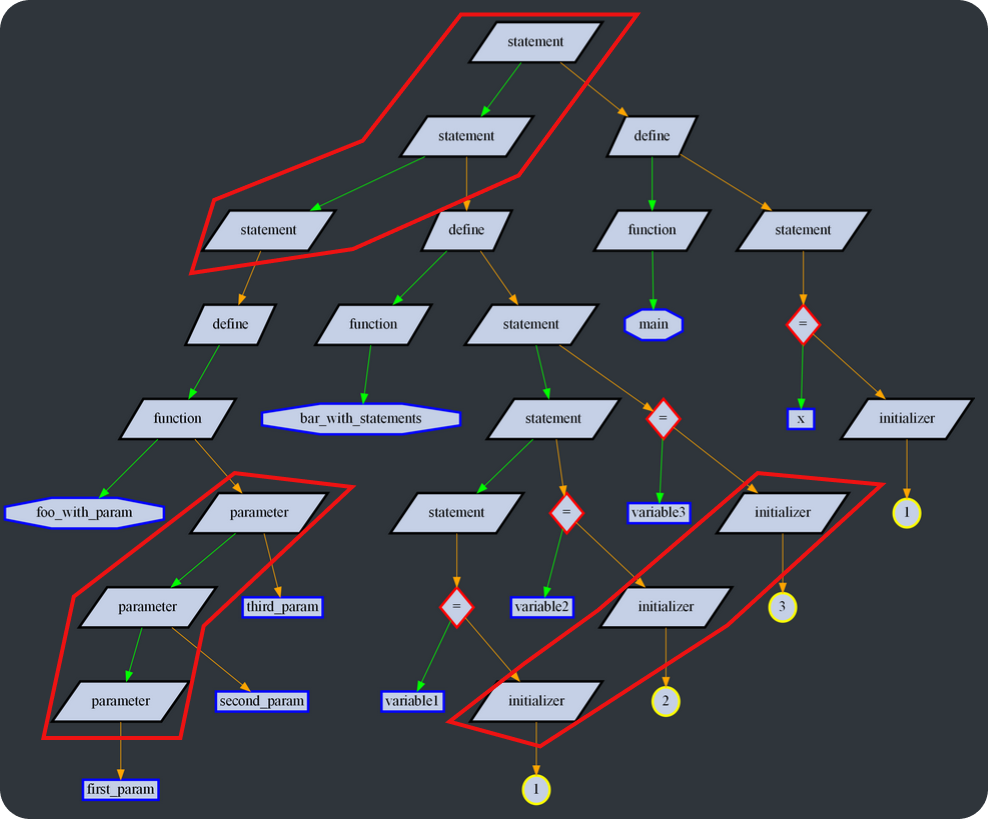

### ***First branch and `main` function***
Branch of `statement`'s containing only **assignments** and **function definitions**. First `statement` of branch should be the root of the tree. This branch holds global variables and function definitions.

In ***first branch*** `main` function should be defined. Program execution starts from this function.

    foo(a, b)
    {
        x = a;
    }

    GLOBAL_VAR   = 4;
    GLOBAL_VAR_2 = 28 * 4 + GLOBAL_VAR;

    main()
    {
        var = 3 * 8 + 1;
    }

    bar()
    {
        x = GLOBAL_VAR;
    }
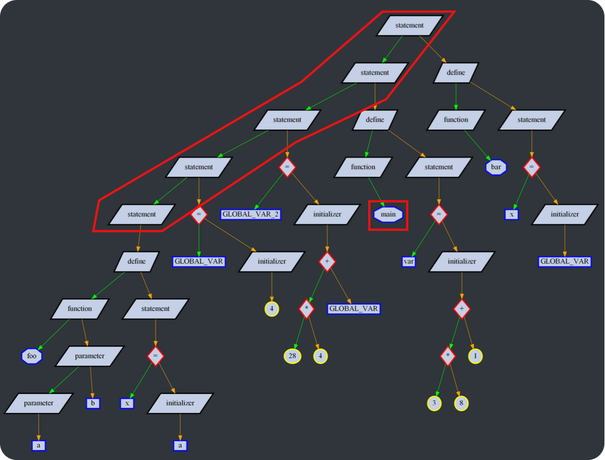

### ***Expression***
Subtree of operators and their operands that specifies a computation.

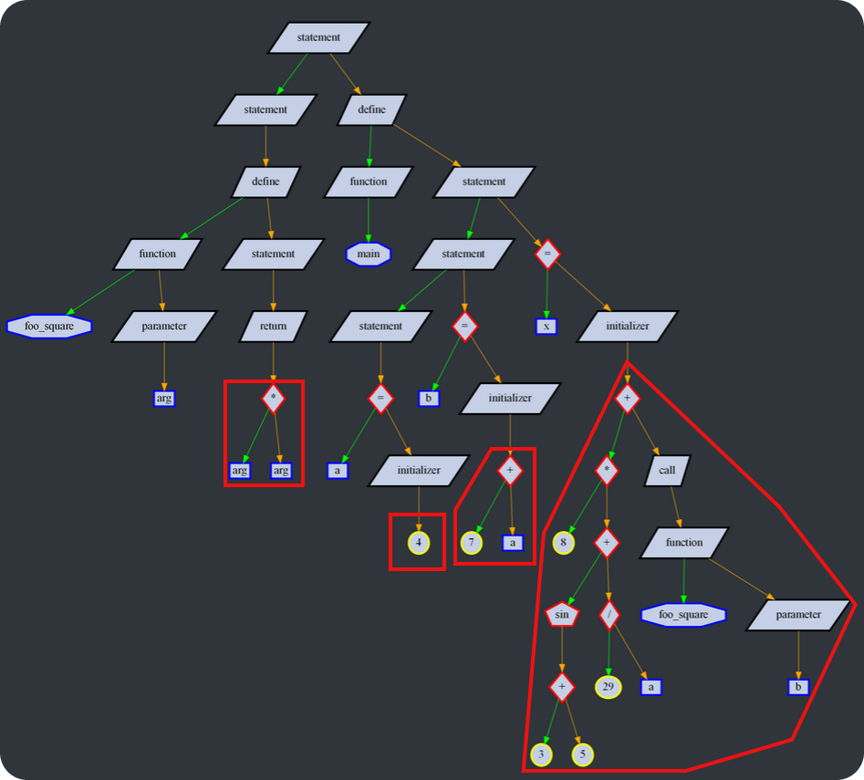

### **Conditional statement**
Executes positive or negative decision depending on condition.

* Parent &ndash; `statement` (not ***first branch***)
* Condition &ndash; ***expression***
* Positive/negative decision &ndash; `statement`

- `if` &ndash; main node of conditional statement
- `decision` &ndash; node for bodies of positive and negative decisions.

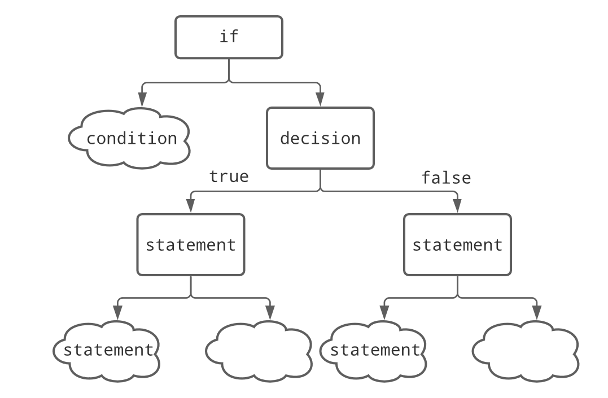

    main()
    {
        a = 1;
        if((a > 2) || (28 * my_sin(1)))
        {
            x = 1;
        }
        else
        {
            return 2;
        }

        return 0;
    }

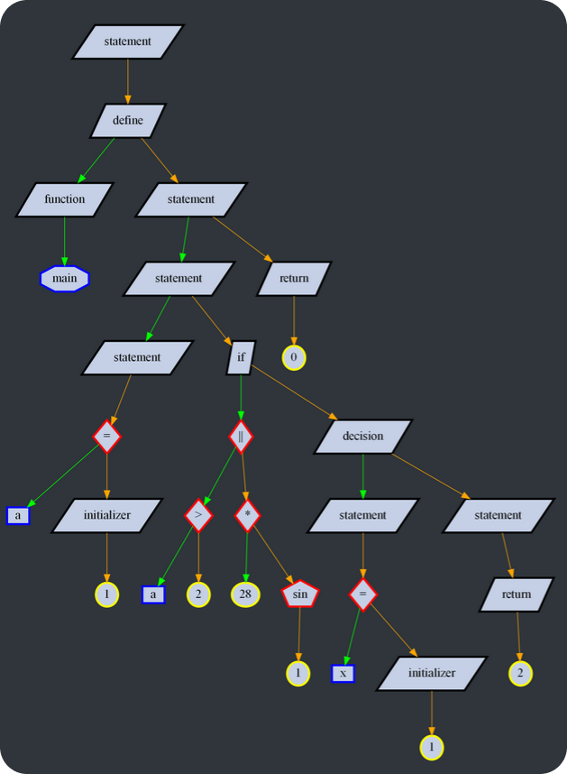

### **Loop statement**
Executes body repeatedly while condition is positive.

* Parent &ndash; `statement` (not ***first branch***)
* Condition &ndash; ***expression***
* Body &ndash; `statement`

- `while` &ndash; main node of loop statement

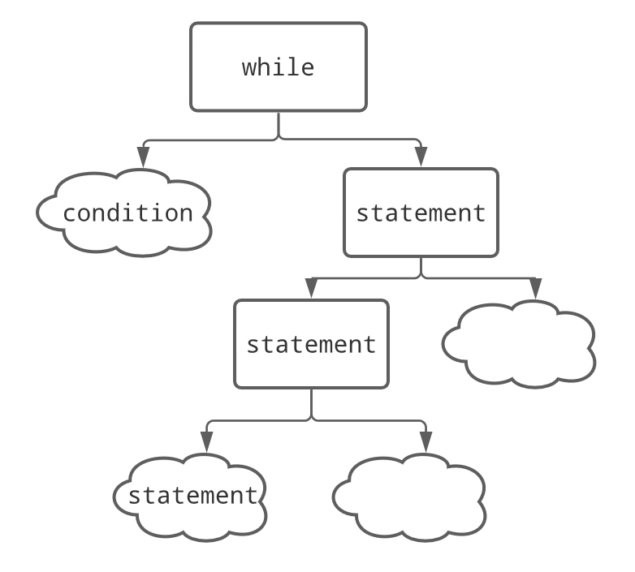
    
    main()
    {
        a = 10;
        b = 0;
        while(a > (b + 1))
        {
            b = b + 1;
            a = a - 1;
        }

        return 0;
    }

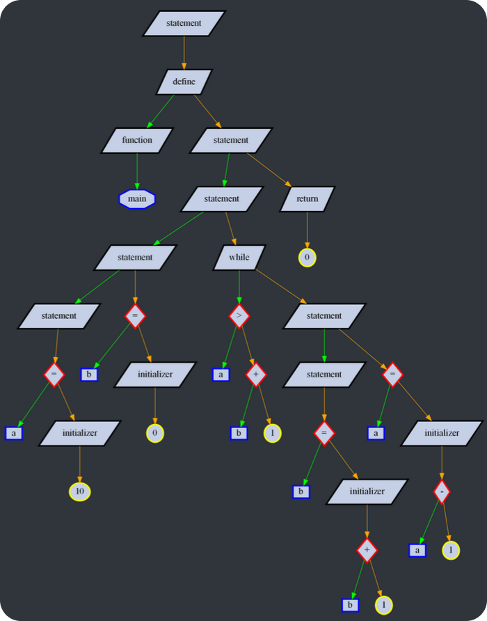

### **Function definition**
Defines function.

* Parent &ndash; `statement` (***first branch*** only)
* Name &ndash; ***identifier*** (function name)
* Name &ndash; ***identifier*** (variable name)

- `define` &ndash; main node of function definition.
- `function` &ndash; node for name and function parameters.
- `parameter` &ndash; node for function parameter.

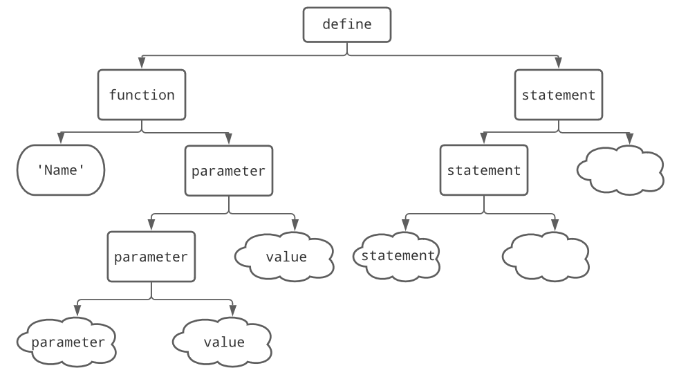

    foo(first_param, second_param, third_param)
    {
        var = first_param;
        x = second_param + third_param;
        
        return 2 * var;
    }
    
    main()
    {
        x = 1;
        return 0;
    }

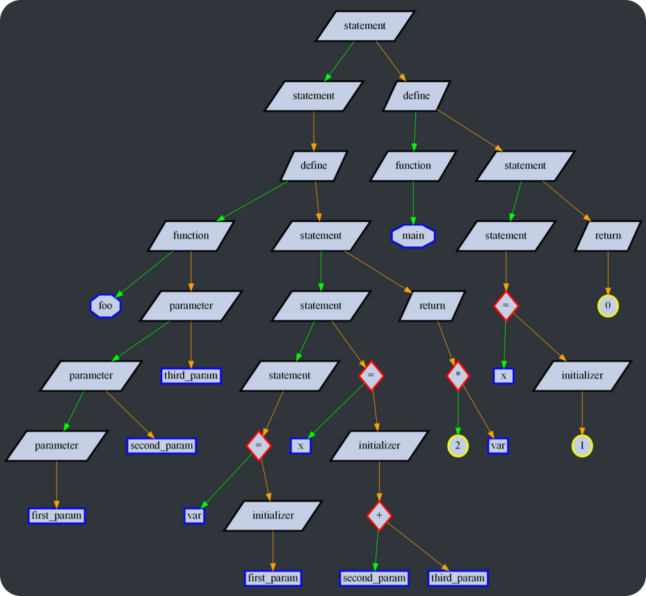

### **Function call**
Calls function.

* Parent &ndash; `statement` (not ***first branch***)
* Name &ndash; ***identifier*** (function name)
* Value &ndash; ***expression***

- `call` &ndash; main node of function call.
- `function` &ndash; node for name and function parameters.
- `parameter` &ndash; node for function parameter.

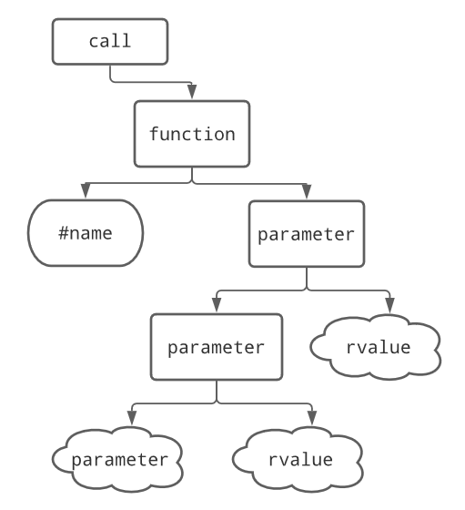

    foo(first_param, second_param, third_param)
    {
        var = first_param;
        x = second_param + third_param;
        
        return 2 * var;
    }
    
    main()
    {
        a = 11;
        x = 5 * 2 + foo(a + 3, (a < 0), a + 8 * a * 99);
        return 0;
    }

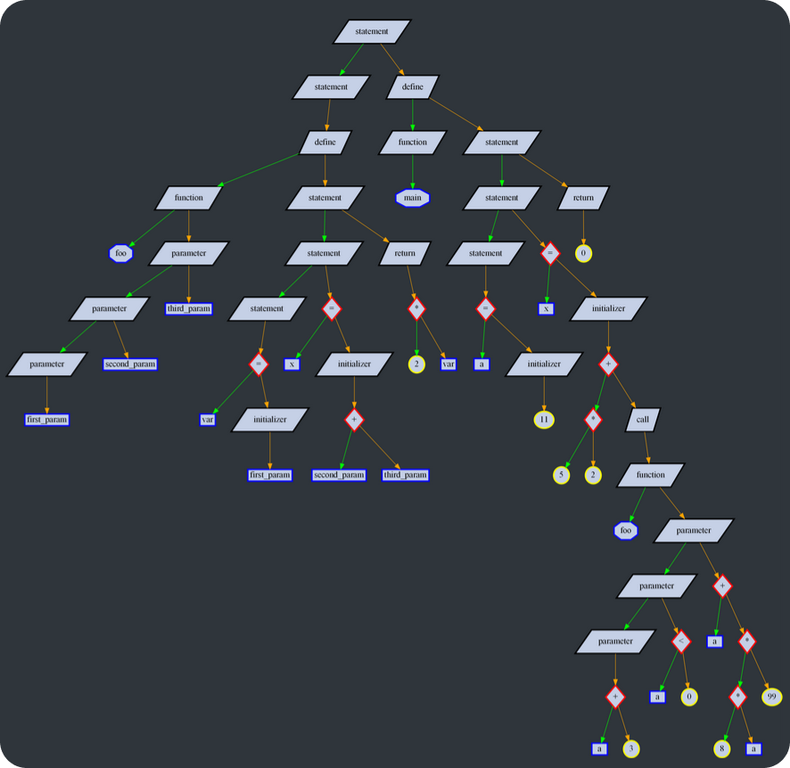

### **Terminational statement**
Terminates current function and returns specified value to caller.

* Parent &ndash; `statement` (not ***first branch***)
* Value &ndash; ***expression***

- `return` &ndash; main node of terminational statement.

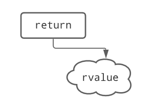

    main()
    {
        var = 1;

        return var + 2 * 3;
    }

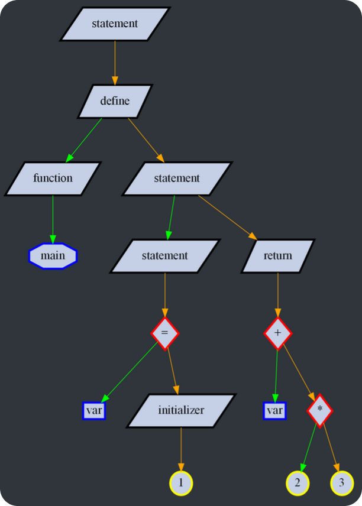

### **Operators**
* Parent &ndash; ***expression***
* Value &ndash; ***expression***

- Operator &ndash; main node, one of the *operators*.

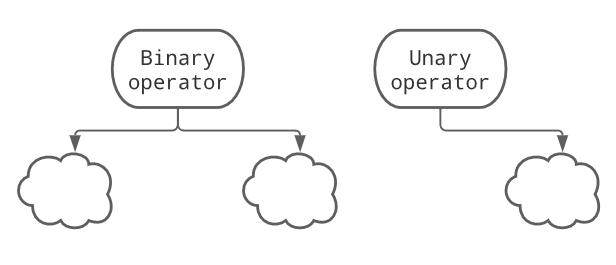

    main()
    {
        var1 = 1 * 1;
        var2 = 1 && (2 * 3);
        var_unary_op = my_sin(5);
        var2_unary_op = !(1 + 2);

        return 0;
    }

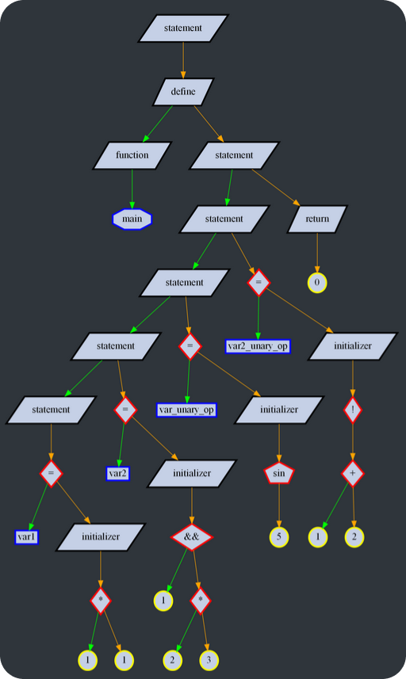

> Unary operator has only right descendant

### **Assignment**
Assigns value to variable.

First initializer is written in memory for variable itself. Every next initializer is written in memory with shift.

* Parent &ndash; `statement` (both ***first branch*** and not ***first branch***)
* Name &ndash; ***identifier*** (variable name)
* Index &ndash; ***expression***
* Value &ndash; ***expression***

- `=` &ndash; main node of assignment.
- `const` &ndash; optional node, specifies that variable is constant
- `initializer` &ndash; node for variable initializer

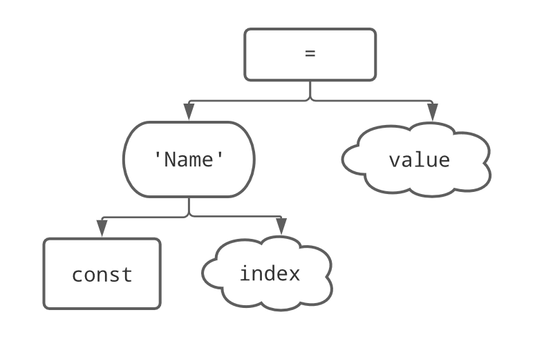

> If index is specified variable is interpreted as array.

> If variable wasn't declared before, index is interpreted as size of array. Otherwise index is interpreted as relative shift before assignment.

> `=` is not an operator, it doesn't return any output. Therefore, it can't be used in ***expression***
---

## Explanations

### **Arrays**
Tree does not distinguish between variables and arrays. Index can be specified for variable.

* **assignment**, variable wasn't declared

    Static memory of *index* size should be allocated. 

* **assignment**, variable was declared

    *Index* should be used as shift in memory relative to variable.

* **expression**, variable wasn't declared

    Error state. It should be guaranteed that no such mistakes are left in stored tree.

* **expression**, variable was declared

    *Index* should be used as shift in memory relative to variable.

### **Global scope**
Every function and global variable is in global scope despite it's location.    

### **Global initializations**
Global initializations must be done before entering `main` function.

